# Xbox下载助手-社区版
改动不一定同步标准版

[English](https://github.com/skydevil88/XboxDownload-EN)

[OpenWrt 安装 Lighttpd 或者 Nginx，使用URL重写跳转国内CDN服务器加速下载](./README_OpenWrt.md)

获取微软商店应用游戏下载链接
---
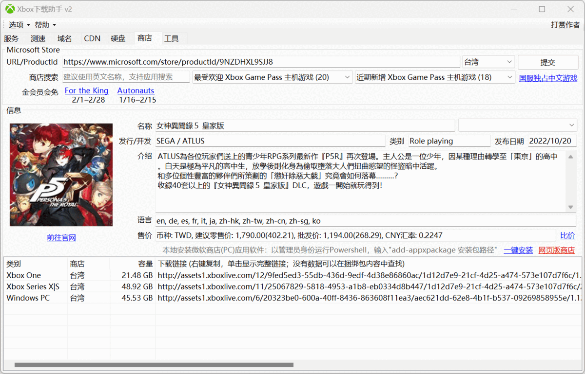
网页版商店：https://xbox.skydevil.xyz

使用PC下载Xbox主机游戏：https://www.bilibili.com/video/BV1CN4y197Js

一键解决EA下载速度慢：https://www.bilibili.com/video/BV1KC4y1i7ZK

使用说明
---
Xbox主机是根据使用者IP分配游戏下载域名，国内IP使用assets1.xboxlive.cn，有国内CDN服务器，下载速度快（冷门游戏没有缓存除外）。国外IP使用assets1.xboxlive.com，没有国内CDN服务器，需要连接到国外，下载速度慢。国内用户使用了加速器或者代理软件，会被微软判断为国外用户并被分配使用com下载域名。


本软件提速原理，把 Xbox 下载链接 assets1.xboxlive.com 跳转到 assets1.xboxlive.cn 上，锁定在国内服务器下载，解决使用国际域名下载速度过慢问题，并且能同时支持 PC微软商店、PS、NS、EA Desktop & Origi、战网国际服、Epic游戏下载加速。

下载链接
```
百度网盘: https://pan.baidu.com/s/1ZqBvWjpGYZXBL8WaitMLCQ?pwd=q3cp 提取码：q3cp
源码：https://github.com/skydevil88/XboxDownload
```
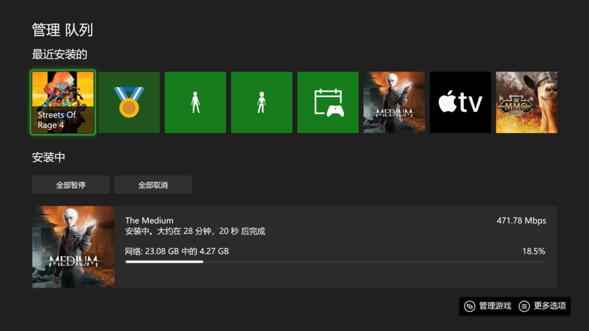

1.使用设置（Nintendo Switch、PlayStation 使用方法同理）
---
Xbox正在下载，请先暂停，完成设置后再继续。

一、启动下载助手，选中测速-在线导入IP，找你家附近IP测试速度（可以使用查找功能），右键使用指定IP。

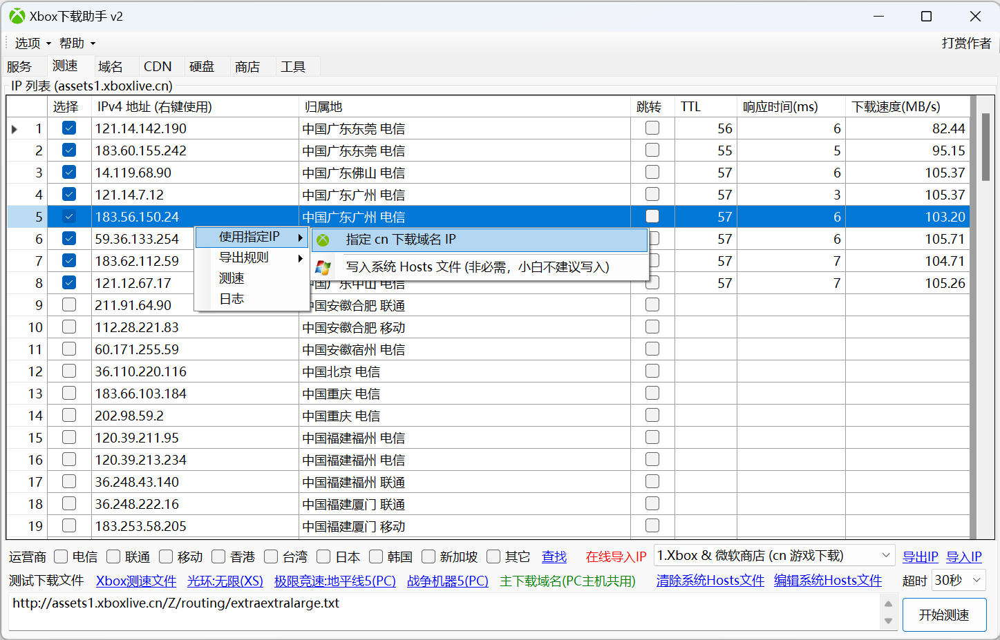

二、本机IP选择跟Xbox同一IP段，一般是192.168.x.x，我这里是192.168.50.5，请自行判断选择。确认勾选 1.启用DNS服务，2.启用HTTP服务 这两项，然后点击 开始监听。

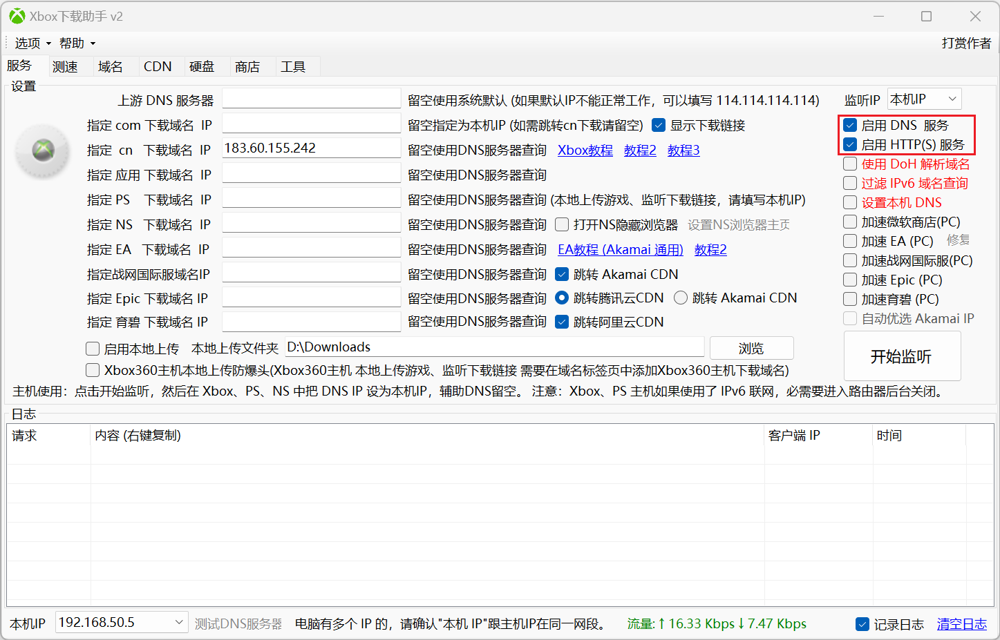


三、打开XBOX 设置->常规->网络设置->高级设置->DNS 设置->手动 把 主DNS 设为PC电脑IP（Xbox下载助手左下角 本机IP），辅助DNS留空。(PC微软商店此步骤省略，勾上加速微软商店)

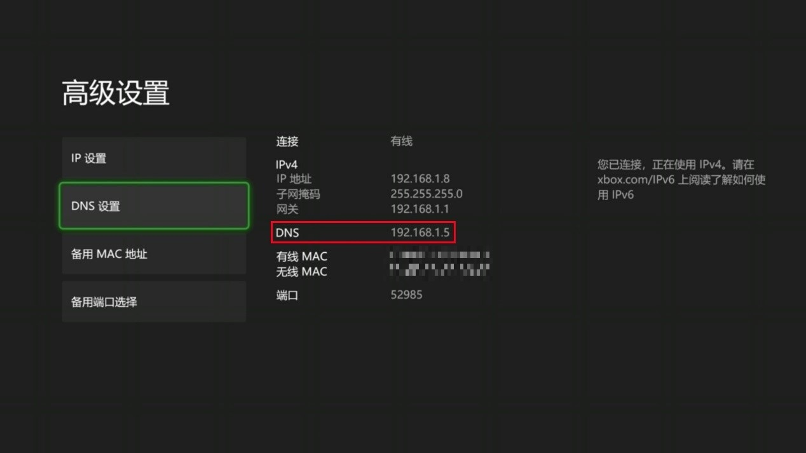

注意，如果你的Xbox正在使用IPv6联网， 需要在路由器中关闭IPv6功能。

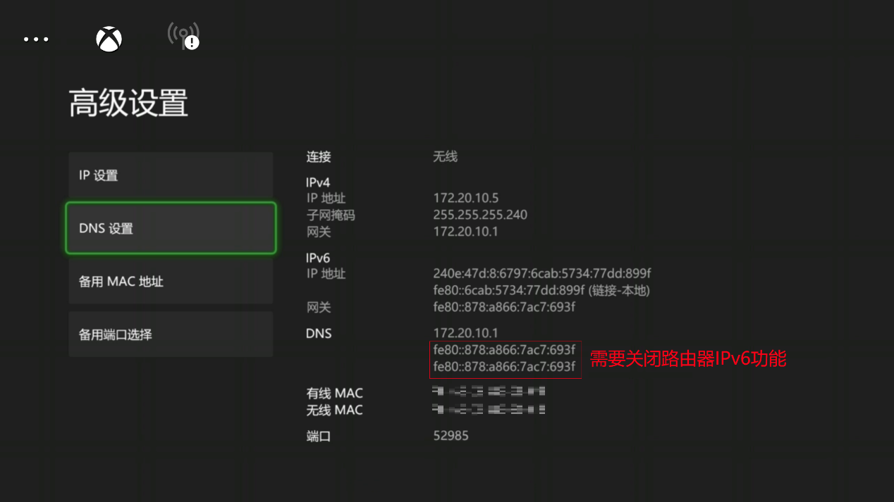

现在可以开始愉快地下载了。

下载完成后记得把Xbox DNS改回自动获取，否则Xbox下载助手关闭后没法联网。


其它问题：

一、	没有日志，第一种情况本机IP没有选择正确，请重新选择；第二种情况被电脑网络防火墙阻止，请关闭电脑网络防火墙，还有各种电脑管家之类软件。

二、	检测端口被占用，通常按是强制结束就能正常启动，不能结束可以用命令“netstat -an”查看占用端口程序，如何停止请自行上网搜索。

三、	下载没有HTTP 301日志，Xbox直接使用了cn域名下载，省去HTTP服务跳转这一步骤，所以就没有HTTP日志。

四、	Xbox通过电脑WiFi热点连接网络需要以下设置，1、取消启用DNS 服务，2、勾选加速微软商店(PC)，3、本机IP选择热点IP。

Xbox主机DNS可以不用设置，直接自动获取。

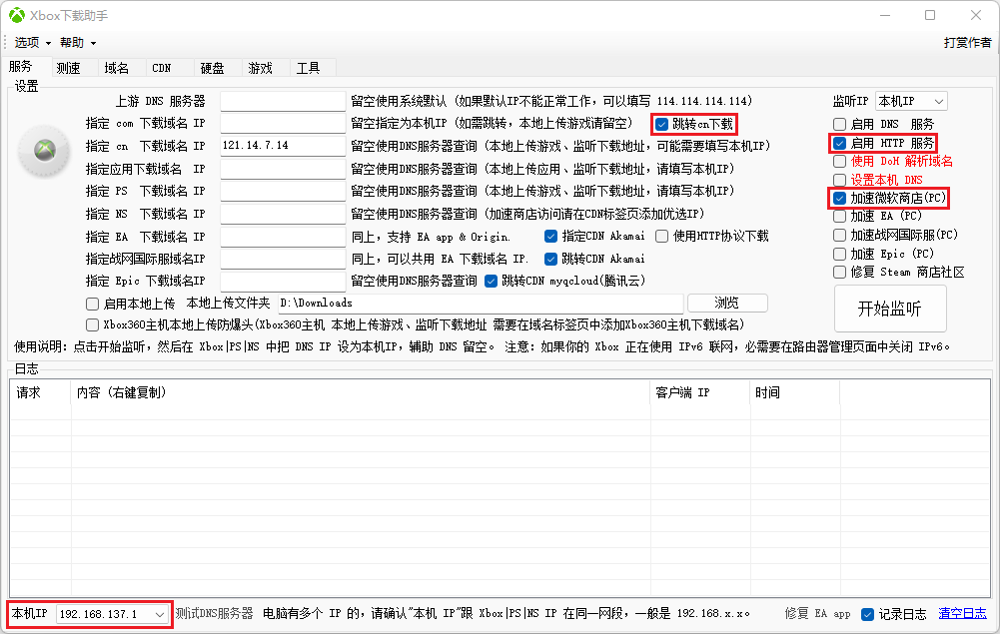


2.PC下载回传（PC XGP、PlayStatio、EA同样适用）
---
有两种方法回传Xbox，首先使用下载助手监听到游戏下载地址（勾选显示下载链接），暂停下载，右键复制下载地址，然后使用PC下载工具把文件下载回来。

PC XGP游戏也可以用此方法监听到下载地址，然后使用下载工具下载，完成后在 工具->离线安装微软商店应用软件 中安装。

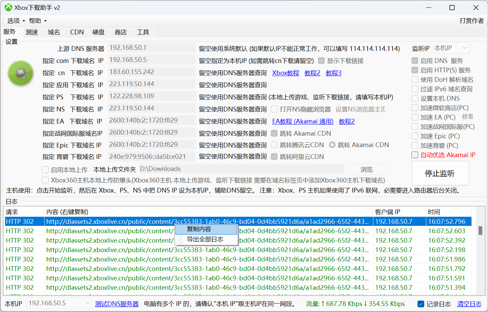

方法一：本地上传

把本地上传文件夹指向下载文件夹位置，勾选本地上传后启动监听，Xbox重新下载，就可以直接从PC上传Xbox。

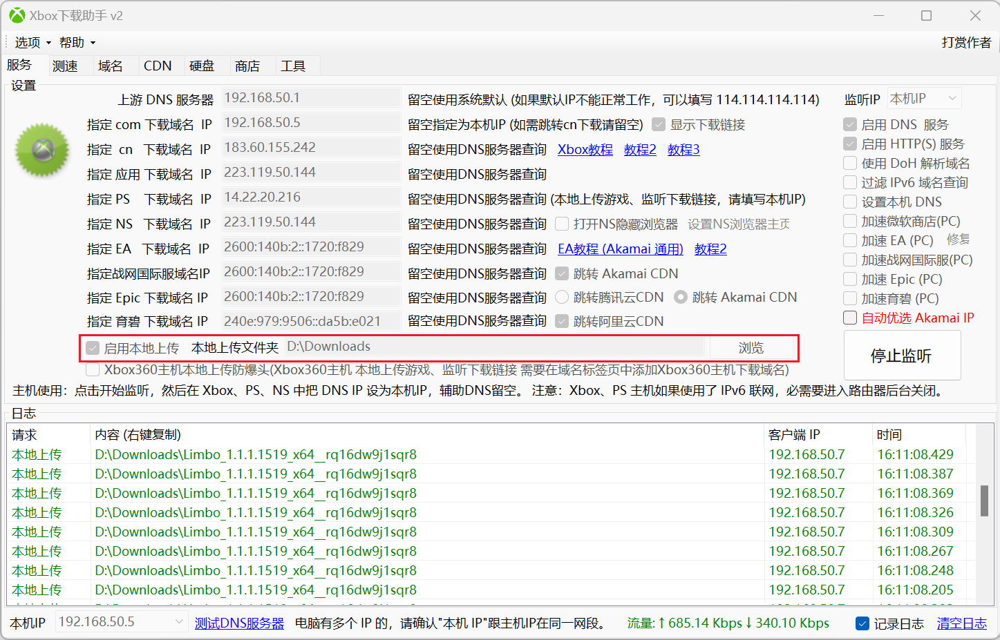

方法二：硬盘导入

Xbox外置移动硬盘接到PC上，然后在下载助手转换成PC模式，可能需要关闭杀毒软件，接着把下载游戏文件复制进去重命名为Content ID（也可以直接把游戏下载到移动硬盘根目录，省去复制这一步），完成后转换回Xbox模式。把刚才Xbox暂停下载的游戏删除，外置移动硬盘接回Xbox，开机联网（必须联网），设置-系统-存储，选择移动硬盘，把游戏移动到内部硬盘。注意不要在移动硬盘中启动游戏，否则游戏会重新下载，应用不支持硬盘方法导入。 

重命名Content ID方法：硬盘-文件信息-本地文件-浏览，选择文件，然后点击重命名本地文件。

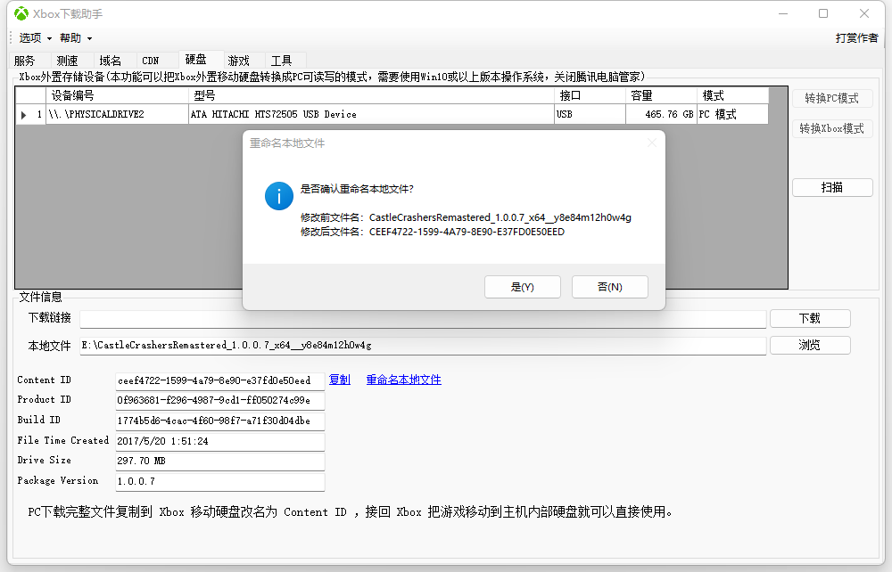


3.不想开电脑下载
---
OpenWrt 安装 Lighttpd 或者 Nginx，使用URL重写跳转国内CDN服务器加速下载
https://github.com/skydevil88/XboxDownload/blob/master/README_OpenWrt.md


其它路由器如果支持改Hosts，可以分别把 com 和cn 下载域名测速后找出最快IP写进Hosts 中，不管Xbox使用那个域名下载都能加速。

CN域名（可以使用Akamai IP，对于CDN没有缓存的老游戏、冷门游戏可能效果更佳）
```
#第一组，主下载域名（PC主机共用）
address=/assets1.xboxlive.cn/cn IP 或者 Akamai IP 
address=/assets2.xboxlive.cn/cn IP 或者 Akamai IP 
address=/d1.xboxlive.cn/cn IP 或者 Akamai IP 
address=/d2.xboxlive.cn/cn IP 或者 Akamai IP 

#第二组，XboxOne部分老游戏下载域名，PC、主机新游戏都不再使用此域名。
address=/dlassets.xboxlive.cn/cn IP 或者 Akamai IP 
address=/dlassets2.xboxlive.cn/cn IP 或者 Akamai IP 

#第三组，应用和部分PC游戏使用此域名下载
#Xbox APP提示“此游戏不支持安装到特定文件夹。它将与其他Windows应用一起安装。”, 这些都是使用应用下载域名
address=/dl.delivery.mp.microsoft.com/cn IP 或者 Akamai IP 
address=/tlu.dl.delivery.mp.microsoft.com /cn IP 或者 Akamai IP
```
COM域名（不能使用cn IP）
```
address=/assets1.xboxlive.com/Akamai IP
address=/assets2.xboxlive.com/Akamai IP
address=/xvcf1.xboxlive.com/Akamai IP
address=/xvcf2.xboxlive.com/Akamai IP
address=/d1.xboxlive.com/Akamai IP
address=/d2.xboxlive.com/Akamai IP
address=/dlassets.xboxlive.com/Akamai IP
address=/dlassets2.xboxlive.com/Akamai IP
```
注意：不少人直接把 com 域名指定到 cn ip、或者使用 CNAME 解释到 cn IP，这两种方法都是错误的，服务器会返回403错误。 com域名不能使用cn IP，反过来cn域名可以使用Akamai IP.

关于
---
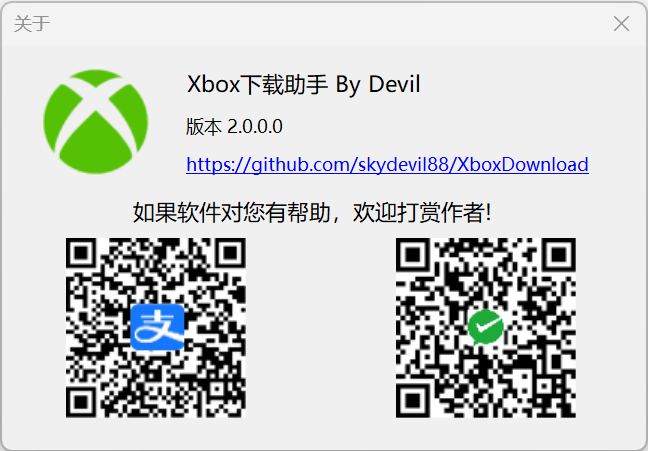
