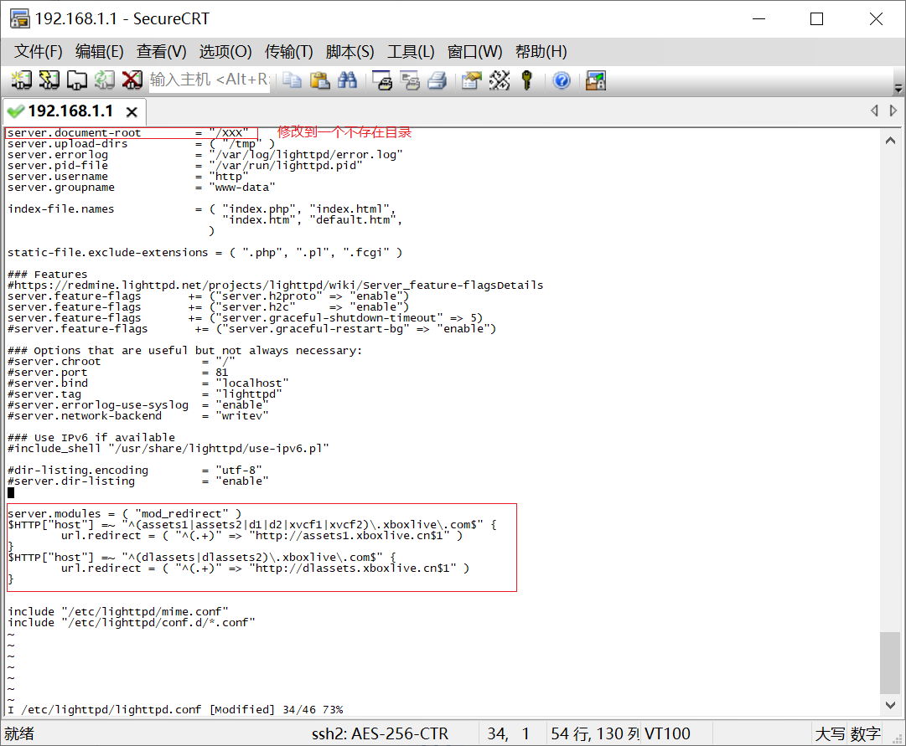
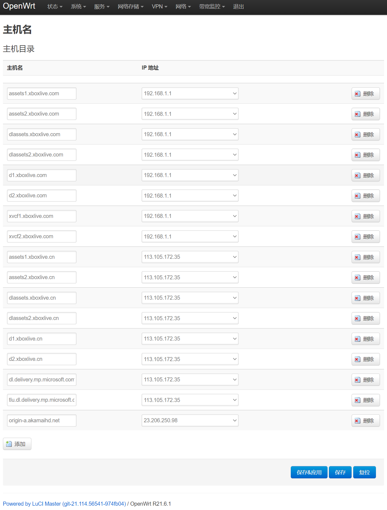
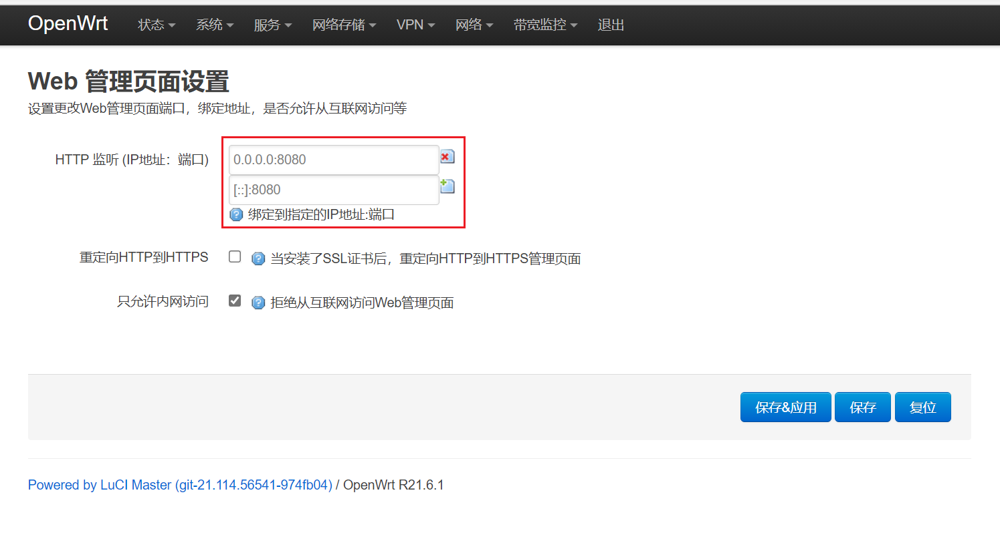
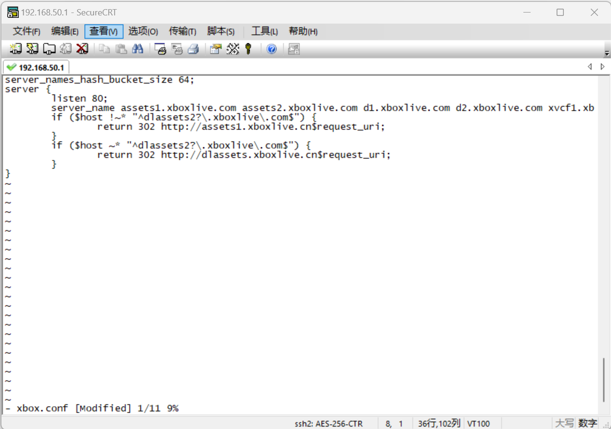
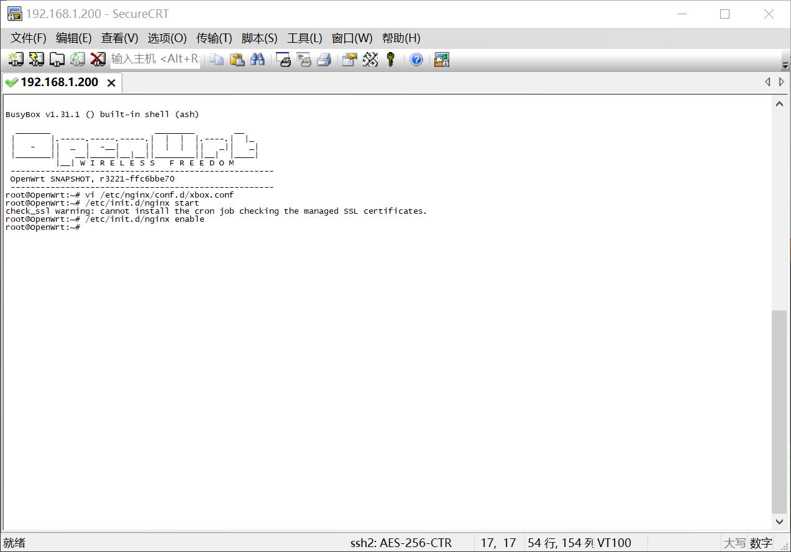

# OpenWrt 安装 Lighttpd、Nginx、Caddy，使用URL重写跳转国内CDN服务器加速下载

注意：不少人直接把 com 域名指定到 cn ip、或者使用 CNAME 解释到 cn IP，这两种方法都是错误的，服务器会返回403错误。
com域名不能使用cn IP，反过来cn域名可以使用部分com IP(Akamai). 

提速原理请参考PC [Xbox下载助手](https://github.com/skydevil88/XboxDownload "Xbox下载助手")，同时支持PC微软商店加速。
支持Docker路由器(小米、TP-LINK等部分型号)、NAS也可以通过Docker使用macvlan创建独立ip安装Nginx实现跳转国内下载。

Xbox使用此方法需要关闭路由器IPv6功能，如果有其它设备需要用到IPv6，可以在 网络->防火墙->自定义规则 中添加以下两条规则屏蔽掉Xbox的IPv6地址。（XBOX_MAC替换成Xbox Mac地址，地址之间要用“:”号分隔，不能用“-”，用有线网络就两个都填有线mac, 用无线网络就两个都填无线mac）
```bash
ip6tables -I INPUT -p icmpv6 -m mac --mac-source XBOX_MAC -j DROP 
ip6tables -I INPUT -p udp -m mac --mac-source XBOX_MAC --dport 547 -j DROP
```

注意：以下教程里面的 192.168.1.1 替换为您的Openwrt路由器的ip地址

## 方法一：Lighttpd 
B站视频教程：https://www.bilibili.com/video/BV1wP4y1G7zf

1. 修改uhttpd端口（修改后进入OpenWrt管理页面要用 192.168.1.1:8080，修改端口目的是要让出80端口给Lighttpd或者Nginx使用）
```bash
vi /etc/config/uhttpd
#按 i 进入编辑模式，
list listen_http '0.0.0.0:80' --> list listen_http '0.0.0.0:8080
list listen_http '[::]:80' --> list listen_http '[::]:8080'
#按ESC键 跳到命令模式，然后输入 :wq 保存文件并退出vi, 重启uhttpd
/etc/init.d/uhttpd restart
```


2.安装 lighttpd
```bash
opkg update
opkg install lighttpd lighttpd-mod-redirect lighttpd-mod-proxy
```

3.配置 lighttpd
```bash
vi /etc/lighttpd/lighttpd.conf
#按 i 进入编辑模式，然后复制下面代码，Shift+Inset 粘贴，按ESC键 跳到命令模式，然后输入 :wq 保存文件并退出vi

server.modules = ( "mod_redirect" )
$HTTP["host"] =~ "^(assets1|assets2|d1|d2|xvcf1|xvcf2)\.xboxlive\.com$" {
	url.redirect = ( "(.*)" => "http://assets1.xboxlive.cn$1" )
}
$HTTP["host"] =~ "^(dlassets|dlassets2)\.xboxlive\.com$" {
	url.redirect = ( "(.*)" => "http://dlassets.xboxlive.cn$1" )
}
#其它访问转发到8080端口，进入管理页面不需要加端口(可选)
server.modules +=( "mod_proxy")
proxy.server = ( "" => (( "host" => "127.0.0.1", "port" => 8080	)))

#启动lighttpd服务以及设置其开机自启
/etc/init.d/lighttpd start
/etc/init.d/lighttpd enable
#重启lighttpd
/etc/init.d/lighttpd restart
```


4.打开OpenWrt管理页 网络-》主机名 ，添加 主机名：
```bash
xvcf1.xboxlive.com			192.168.1.1
xvcf2.xboxlive.com			192.168.1.1
assets1.xboxlive.com			192.168.1.1
assets2.xboxlive.com			192.168.1.1
d1.xboxlive.com				192.168.1.1
d2.xboxlive.com				192.168.1.1
dlassets.xboxlive.com			192.168.1.1
dlassets2.xboxlive.com			192.168.1.1

#xxx.xxx.xxx.xxx 可以使用Xbox下载助手测速找出最快IP，分两组IP，目前国内IP大部分不通用，需要分别测速(Akamai IP可以通用)
#第一组，主下载域名（PC主机共用）
assets1.xboxlive.cn			xxx.xxx.xxx.xxx
assets2.xboxlive.cn			xxx.xxx.xxx.xxx
d1.xboxlive.cn				xxx.xxx.xxx.xxx
d2.xboxlive.cn				xxx.xxx.xxx.xxx
#第二组，应用和部分游戏使用此域名下载
dl.delivery.mp.microsoft.com		xxx.xxx.xxx.xxx
tlu.dl.delivery.mp.microsoft.com	xxx.xxx.xxx.xxx
dlassets.xboxlive.cn			xxx.xxx.xxx.xxx
dlassets2.xboxlive.cn			xxx.xxx.xxx.xxx
```




最后在浏览器中输入(电脑需要关闭IPv6，建议在 InPrivate 窗口中打开链接，避免浏览器缓存) http://xvcf1.xboxlive.com/Z/routing/extraextralarge.txt, 看到地址变成 http://assets1.xboxlive.cn/Z/routing/extraextralarge.txt 表示成功跳转到cn，接着打开你的Xbox又能愉快地下载。


## 方法二：Nginx	
注：部分使用了Nginx替换Uhttpd固件可以省略步骤 1、2 
1. 修改uhttpd端口, 这次用管理页面直接修改(系统->Web管理)，端口改为8080保存重启。
没有此页面可以参考上面Lighttpd修改uhttpd端口


2. 重启后选择 系统->软件包，刷新列表，过滤器中输入 nginx 查找，找到后安装 nginx。


3. SSH连进路由器
```bash
vi /etc/nginx/conf.d/xbox.conf
#按 i 进入编辑模式，然后复制下面代码，Shift+Inset 粘贴，按ESC键 跳到命令模式，然后输入 :wq 保存文件并退出vi
#启动报错可以增加以下一句，server_names_hash_bucket_size 64; 不够就按32倍数往上加(128、256)

server_names_hash_bucket_size 64;
server {
        listen 80;
        server_name assets1.xboxlive.com assets2.xboxlive.com d1.xboxlive.com d2.xboxlive.com xvcf1.xboxlive.com xvcf2.xboxlive.com dlassets.xboxlive.com dlassets2.xboxlive.com;
        if ($host !~* "^dlassets2?\.xboxlive\.com$") {
                return 302 http://assets1.xboxlive.cn$request_uri;
        }
        if ($host ~* "^dlassets2?\.xboxlive\.com$") {
                return 302 http://dlassets.xboxlive.cn$request_uri;
        }
}

#启动 nginx 服务以及设置其开机自启。
/etc/init.d/nginx start
/etc/init.d/nginx enable
#重启nginx
/etc/init.d/nginx restart
```



4.打开OpenWrt管理页(http://192.168.1.1:8080) 网络-》主机名 ，添加 主机名：
```bash
xvcf1.xboxlive.com			192.168.1.1
xvcf2.xboxlive.com			192.168.1.1
assets1.xboxlive.com			192.168.1.1
assets2.xboxlive.com			192.168.1.1
d1.xboxlive.com				192.168.1.1
d2.xboxlive.com				192.168.1.1
dlassets.xboxlive.com			192.168.1.1
dlassets2.xboxlive.com			192.168.1.1

#xxx.xxx.xxx.xxx 可以使用Xbox下载助手测速找出最快IP，分两组IP，目前国内IP大部分不通用，需要分别测速(Akamai IP可以通用)
#第一组，主下载域名（PC主机共用）
assets1.xboxlive.cn			xxx.xxx.xxx.xxx
assets2.xboxlive.cn			xxx.xxx.xxx.xxx
d1.xboxlive.cn				xxx.xxx.xxx.xxx
d2.xboxlive.cn				xxx.xxx.xxx.xxx
#第二组，应用和部分游戏使用此域名下载
dl.delivery.mp.microsoft.com		xxx.xxx.xxx.xxx
tlu.dl.delivery.mp.microsoft.com	xxx.xxx.xxx.xxx
dlassets.xboxlive.cn			xxx.xxx.xxx.xxx
dlassets2.xboxlive.cn			xxx.xxx.xxx.xxx
```


最后在浏览器中输入(电脑需要关闭IPv6，建议在 InPrivate 窗口中打开链接，避免浏览器缓存) http://xvcf1.xboxlive.com/Z/routing/extraextralarge.txt, 看到地址变成 http://assets1.xboxlive.cn/Z/routing/extraextralarge.txt 表示成功跳转到cn，接着打开你的Xbox又能愉快地下载。

## 方法三：Caddy

Caddyfile:

```
http://assets1.xboxlive.com, http://assets1.xboxlive.com, http://d1.xboxlive.com, http://d2.xboxlive.com, http://xvcf1.xboxlive.com, http://xvcf2.xboxlive.com {
        redir http://assets1.xboxlive.cn{uri}
}
http://dlassets.xboxlive.com, http://dlassets2.xboxlive.com {
        redir http://dlassets.xboxlive.cn{uri}
}
```

与方法一、二相同，在路由器中把 *.xboxlive.com 域名劫持到 Caddy 服务器 IP.

## 其它：IIS	
https://tieba.baidu.com/p/7151558145


